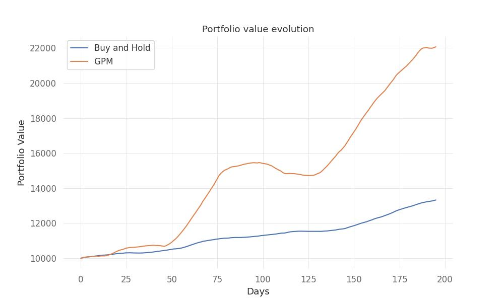

# FinRL_GPM - Investment Portfolio Optimization with Reinforcement Learning



[](LICENSE)
[](https://www.python.org/downloads/)

---

## 🚀 Overview

**FinRL_GPM** is an AI-driven investment portfolio manager leveraging Generalized Policy Mirroring (GPM) reinforcement learning to optimize portfolio allocation across multiple assets. The model learns optimal investment strategies by interacting with financial market environments, aiming to maximize returns while managing risk.

---

## ✨ Key Features

- **Reinforcement Learning Framework**: Built on the FinRL (Financial Reinforcement Learning) library
- **Generalized Policy Mirroring**: Implements the GPM algorithm for robust policy optimization
- **Portfolio Optimization**: Dynamically allocates investments across diverse assets
- **Performance Evaluation**: Tools for comprehensive evaluation and visualization of model performance
- **Jupyter Demo**: Interactive notebook for hands-on experimentation

---

## 📊 Results

The trained model demonstrates significant portfolio growth compared to baseline strategies. See the plot above and the `plots/` directory for detailed results.

---

## 📁 Project Structure

- `train.py` — Main script for training the reinforcement learning model
- `app.py` — Application interface for using the trained model
- `app_test.py` — Script for evaluating model performance
- `dataProcessing.py` — Handles financial data preprocessing
- `FinRL_GPM_Demo.ipynb` — Jupyter notebook demonstrating the model's capabilities
- `policy_GPM.pt` — Pre-trained policy model weights
- `plots/` — Directory containing performance visualization results

---

## 🛠️ Installation

1. **Clone the repository:**
   ```bash
   git clone https://github.com/yourusername/FinRL_GPM.git
   cd FinRL_GPM
   ```
2. **Install dependencies:**
   ```bash
   pip install -r requirements.txt
   ```

---

## 🚦 Usage

### Training a Model
To train a new model from scratch:
```bash
python train.py
```

### Evaluating Model Performance
To evaluate the trained model:
```bash
python app_test.py
```

### Running the Application
To use the trained model interactively:
```bash
python app.py
```

### Demo Notebook
For a comprehensive demonstration, open the Jupyter notebook:
```bash
jupyter notebook FinRL_GPM_Demo.ipynb
```

---

## 🧠 Technical Approach

This project combines financial market data analysis with deep reinforcement learning. The agent learns to make investment decisions by balancing risk and reward across multiple market conditions. The Generalized Policy Mirroring approach enhances traditional RL by improving policy convergence and stability.

---

## 🙏 Acknowledgments

- Built upon the [FinRL](https://github.com/AI4Finance-Foundation/FinRL) framework
- Incorporates Generalized Policy Mirroring techniques for enhanced performance

---

**Stevan Le Stanc**